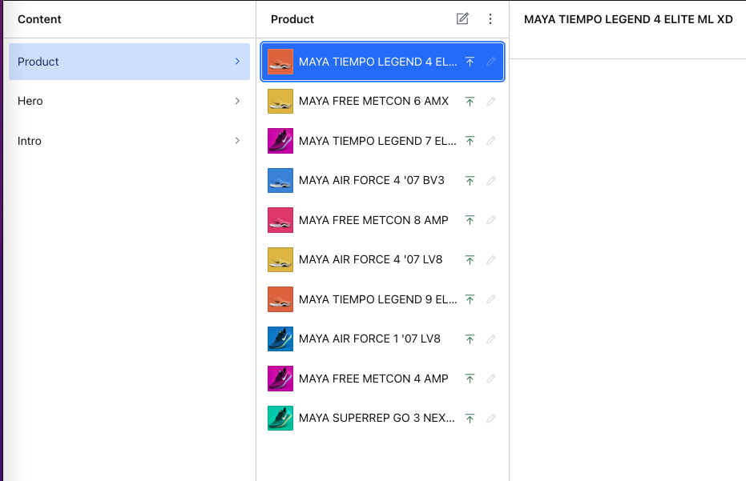

# Maya
Product page in Nextjs connected to Sanity CMS, with responsive design.

## Tech
- Nextjs
- CSS modules
- Sanity

## Implementation
Page "home" with multiple components together with CSS file for each component.

## Features
- Responsive desktop/mobile
- "Show more" button

## Screenshots

